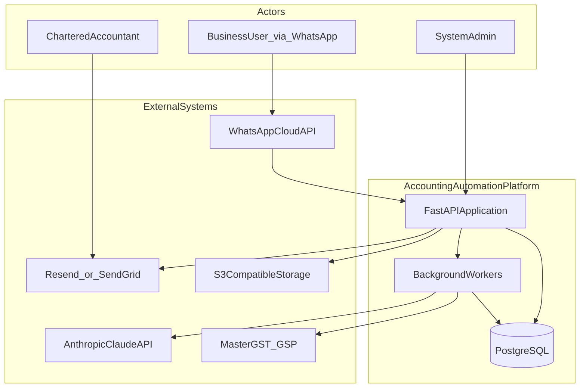
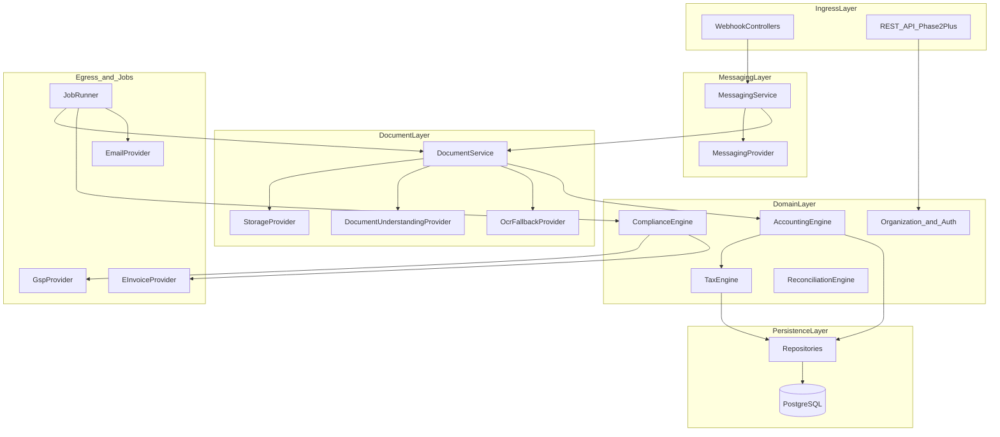
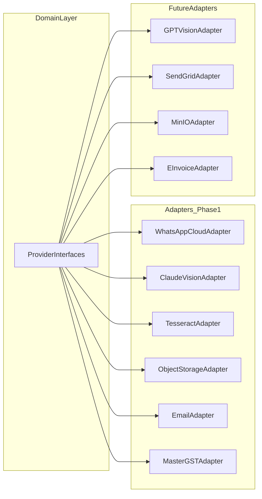
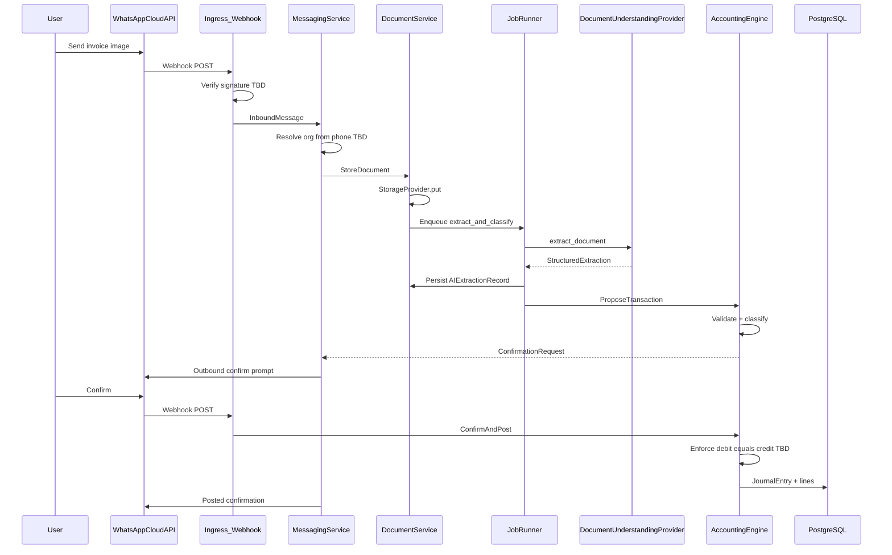
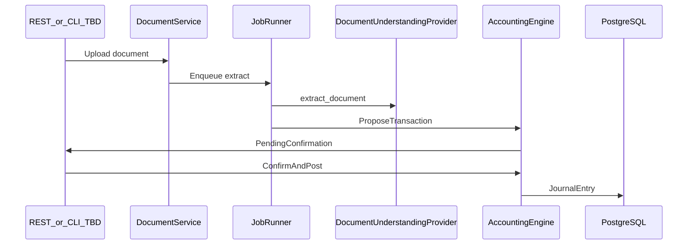
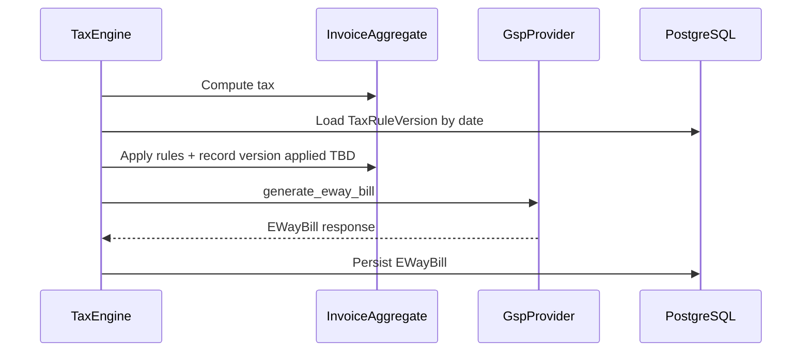
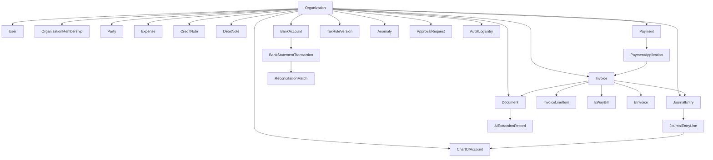
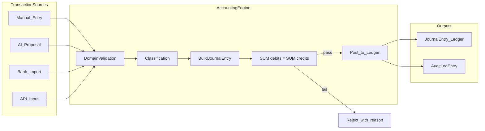
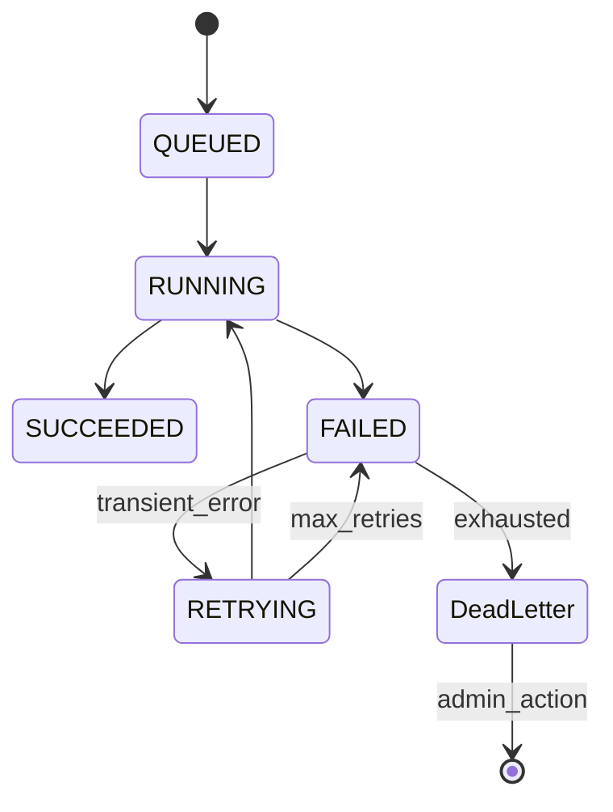
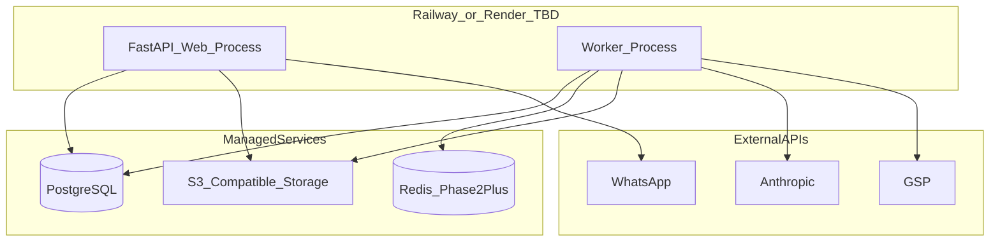

# System Architecture

**Status:** Draft — pending architecture approval gate  
**Stage:** 2 of 18  
**Inputs:** [PRD.md](PRD.md), [PRD_REVIEW.md](PRD_REVIEW.md)  
**Date:** 2026-09-03

This document translates the confirmed portions of the PRD into a technical architecture. Where the PRD is silent or contradictory, decisions are marked **TBD** and linked to question IDs in PRD_REVIEW.md. Nothing marked TBD is treated as a frozen requirement.

---

## Prerequisites and caveats

| Item | Status |
|------|--------|
| PRD completeness | **Incomplete fragment** — see PRD_REVIEW verdict |
| PRD freeze | **Not frozen** — architecture proceeds on ratified PRD excerpts only |
| Blocker questions Q-01–Q-08 | **Unresolved** — architecture documents options, not final choices |

Architecture approval does **not** substitute for PRD freeze. Implementation must not begin until accounting invariants, Phase 1 scope, and auth model are ratified (PRD_REVIEW Q-02, Q-04, Q-05, Q-06).

---

## Architectural principles

Derived from PRD.md where explicitly stated; numbered for reference.

| # | Principle | PRD basis |
|---|-----------|-----------|
| P1 | **Vendor independence** — accounting and tax domain code has zero direct dependency on vendor SDKs; external systems sit behind internal provider interfaces | PRD line 11 |
| P2 | **Documents are the audit backbone** — durable, versioned object storage; not local disk | PRD line 75 |
| P3 | **AI proposes, domain disposes** — document understanding produces structured proposals; only the domain layer (with validation) creates ledger effects | PRD entity model + PRD_REVIEW ACC-13 (recommended, not yet in PRD) |
| P4 | **Financial idempotency** — retried or duplicated jobs must not double-post a financial effect | PRD line 7 |
| P5 | **Tax auditability** — which tax rule version was applied is recorded on the transaction | PRD line 18 |
| P6 | **Tenant isolation** — every tenant-owned entity belongs to an `Organization` | PRD line 18 |
| P7 | **Replaceability** — swapping Claude, WhatsApp, storage, GSP, etc. changes only the adapter, not domain logic | PRD lines 11, 53 |

---

## System context

Indian small-business accounting automation. Primary input channel (Phase 1 per PRD technology choices): WhatsApp. Core capabilities implied by entity model: document ingestion, AI extraction, double-entry ledger, GST/TDS, e-way bill, reporting, multi-tenant SaaS.



---

## Layered architecture

The system is organized so that **only adapters and the API/ worker shell** depend on vendors. Business rules live in the domain layer.



### Layer responsibilities

| Layer | Responsibility | Must not |
|-------|----------------|----------|
| **Ingress** | HTTP webhook verification, request parsing, authn/authz delegation, API versioning (TBD) | Contain accounting rules or call vendor SDKs directly |
| **Messaging** | Normalize inbound/outbound messages; map sender → organization; drive conversation state for confirmations | Parse invoices or post journal entries |
| **Document** | Store files, run extraction pipeline, persist `AIExtractionRecord`, surface proposals to domain | Post to ledger without domain approval |
| **Domain** | Enforce invariants (debit=credit, tenant scope, posting rules), classify transactions, compute tax, orchestrate approvals | Import Anthropic/WhatsApp/Meta SDKs |
| **Persistence** | Repositories, transactions, optimistic locking, tenant-scoped queries | Leak cross-tenant data |
| **Egress / Jobs** | Async execution, retries, idempotency, dead-letter; adapter calls for email, GSP, e-invoice | Bypass domain validation for financial writes |

---

## Provider abstraction

Per PRD Integration Architecture (line 11). Each interface is defined in the **domain/integrations** boundary; default Phase 1 implementations are adapters in **integrations/**.



### Provider catalog

| Interface | Purpose | Phase 1 default (PRD) | Swapping impact |
|-----------|---------|----------------------|-----------------|
| `MessagingProvider` | Inbound/outbound messages, media download | WhatsApp Cloud API | Adapter + webhook config only |
| `DocumentUnderstandingProvider` | Structured extraction + classification | Claude Sonnet (vision) | Adapter + prompt/schema config |
| `OcrFallbackProvider` | Fallback text extraction | Tesseract | Adapter only; trigger rules TBD (Q-21) |
| `EmailProvider` | Transactional email (CA reports, notifications) | Resend or SendGrid (TBD Q-28) | Adapter only |
| `StorageProvider` | Durable versioned document storage | S3-compatible (R2/host/MinIO TBD Q-15) | Adapter + bucket config |
| `GspProvider` | E-way bill (sandbox → production) | MasterGST/Masters India (TBD Q-16) | Adapter + credentials |
| `EInvoiceProvider` | E-invoicing | **Not connected Phase 1** — interface only | Phase 3+ |
| `HostingTarget` | Deployment target | Railway/Render (TBD Q-29) | Infrastructure only |

`HostingTarget` is deployment configuration, not a runtime code interface like the others.

### Interface ownership rule (P1)

```
Domain services  →  depend on  →  Provider interfaces (abstract)
Adapters         →  implement  →  Provider interfaces
Adapters         →  depend on  →  Vendor SDKs / HTTP clients
Domain services  →  must never import vendor SDKs
```

Method signatures and error contracts are defined in Stage 4 (API & Integration Contracts / TECHNICAL_DESIGN.md). This architecture document establishes **boundaries only**.

---

## Core data flows

### Flow A — WhatsApp invoice to posted entry (target end-state)

Sequence assumes human confirmation (P3, pending PRD ratification Q-06).



### Flow B — Document processing without WhatsApp (test path)

Allows AI and accounting to be built and tested before WhatsApp integration (development principle from project workflow).



### Flow C — Tax and e-way bill (Phase 1 partial)



---

## Domain model architecture

Conceptual aggregates from PRD Database Model (lines 16–18). Schema detail deferred to Stage 5 (Database & Domain Design).



### Accounting engine (center of gravity)

Per project workflow: build the accounting engine **before** AI and WhatsApp. The engine is the system of record.



**TBD (Q-05):** Whether `BalanceCheck` is domain-only, DB constraint, or both.

**TBD (Q-06):** Whether `AIProp` can skip human confirmation above a confidence threshold.

**Rule (P3):** `DocumentUnderstandingProvider` output never writes to `JournalEntry` directly.

---

## Background processing architecture

PRD line 7 defines job requirements; PRD line 66 defers Celery/Redis to Phase 2+. **CON-01 unresolved.**

### Target state (PRD line 7 — ratified requirement)



| Concern | Design |
|---------|--------|
| Idempotency | Every financial job carries an `idempotency_key`; domain checks before post |
| Retry | Exponential backoff; only transient errors (network, rate limit) |
| Dead letter | Failed jobs surfaced to admin — not silently dropped (PRD line 7) |
| Job types | AI/OCR, reports, email, bank processing, reconciliation, notifications, e-way bill, e-invoice (PRD line 5) |

### Phase 1 options (pending Q-03)

| Option | Pros | Cons |
|--------|------|------|
| **A — Minimal queue from day one** (Redis + RQ) | Satisfies line 7; idempotency + DLQ feasible | Ops surface in pilot |
| **B — FastAPI BackgroundTasks** (PRD line 66) | Simplest pilot setup | No state, retry, or DLQ — **violates line 7** |
| **C — DB-backed job table + worker loop** | No Redis; auditable states | Custom worker to maintain |

**Architecture recommendation (pending ratification):** Option A or C for any job that can cause a financial post. Option B acceptable only for non-financial jobs (e.g. email dispatch) with explicit PRD exception.

---

## Multi-tenancy architecture

PRD line 18: every tenant-owned entity → `Organization`.

| Approach | Description | Status |
|----------|-------------|--------|
| Application scoping | All repository queries include `organization_id`; enforced in service layer | Baseline assumption |
| Postgres RLS | Row-level policies on tenant tables | TBD Q-17 |
| Request context | `OrganizationContext` propagated from auth/webhook resolution | Required |

**TBD (Q-04):** WhatsApp sender → organization binding (phone registry, invite codes, admin mapping).

Cross-tenant access must be **structurally impossible** at repository boundary — test requirement from project workflow.

---

## Security architecture (high level)

PRD defers dashboard auth to Phase 2+ (line 100). Phase 1 security is **underspecified in PRD** — items below are architectural placeholders pending Q-04, Q-07, Q-31.

| Concern | Phase 1 approach (TBD) |
|---------|------------------------|
| WhatsApp webhook | HMAC signature verification (Meta standard) |
| Sender authentication | Phone → org mapping + optional PIN/confirm pattern |
| Authorization | Role-based; roles undefined in PRD (Q-10) |
| Document access | Org-scoped storage keys; signed URLs with expiry |
| Secrets | Environment / secret manager; never in repo |
| AI data handling | Invoice PII sent to Anthropic — DPA and retention TBD (Q-31) |
| Audit | `AuditLogEntry` on all financial mutations |

---

## Deployment architecture



| Component | Phase 1 | Phase 2+ |
|-----------|---------|----------|
| Web process | FastAPI + uvicorn | Same |
| Worker process | Same container or separate service | Dedicated worker |
| PostgreSQL | Managed (Supabase/Neon/Railway) | Same |
| Redis | Optional if Q-03 → Option A | Celery/RQ |
| Object storage | S3-compatible, versioned | Same |
| Monitoring | Structured logs + Sentry free tier | Same |

**Storage note (CON-03):** Host bundled disk is **not** acceptable for `StorageProvider` — use external S3-compatible store with versioning (PRD line 75).

---

## Reporting architecture (Phase 2+)

PRD lines 95–98: pandas + openpyxl + reportlab behind a `ReportingService`. Reports read from domain/ledger via repositories — **never** direct SQL from templates. Report set **TBD** (Q-18).

---

## Search architecture

PRD lines 110–113: PostgreSQL full-text search through Phase 3. Requirements **TBD** (Q-19). Dedicated search engine deferred until proven necessary.

---

## Dashboard architecture (Phase 2+)

PRD lines 100–103: dashboard is a **view over the domain**, not a second business-logic layer.

```
Dashboard UI  →  REST API  →  Services  →  Domain  →  Repositories  →  PostgreSQL
```

Auth: self-hosted JWT/session, OSS toolkit, or managed provider — **TBD** (Q-30).

---

## Proposed phase mapping

Phases are **not defined in PRD** (STR-05). Below is a proposed mapping for architecture planning only — **must be ratified (Q-02)** before implementation.

| Phase | Architectural scope |
|-------|----------------------|
| **Phase 1 — Pilot MVP** | FastAPI shell, Postgres, org/user (minimal), accounting engine, document upload + AI extraction, manual confirmation, purchase invoice posting, basic GST on lines, WhatsApp adapter (if auth resolved), sandbox e-way bill |
| **Phase 2** | Dashboard + auth, Celery/RQ jobs, bank import + reconciliation, reporting, email to CA |
| **Phase 3** | E-invoice provider, advanced tax returns prep (scope TBD Q-08), search |
| **Phase 5** | Production hardening, hosting re-evaluation, monitoring scale-up |

---

## Component-to-technology map

| Component | Technology (PRD) |
|-----------|----------------|
| API framework | Python / FastAPI |
| Validation / AI schema | Pydantic |
| Database | PostgreSQL |
| ORM / migrations | TBD in tech design (SQLAlchemy + Alembic assumed, not in PRD) |
| AI extraction | Claude Sonnet vision API |
| OCR fallback | Tesseract |
| Queue | Celery + Redis or RQ (Phase 2+ per PRD; Q-03 may pull earlier) |
| Storage | S3-compatible |
| Email | Resend or SendGrid |
| Reports | pandas, openpyxl, reportlab |
| Hosting | Railway or Render |

---

## Open decisions blocking detailed design

These must be resolved before Stage 3 (Technical Design) or marked as accepted assumptions.

| ID | Question | Impact on architecture |
|----|----------|------------------------|
| Q-03 | Phase 1 job infrastructure | Worker topology, Redis presence |
| Q-04 | Phase 1 WhatsApp auth | Ingress + messaging layer design |
| Q-05 | Debit=credit enforcement layer | Domain + DB constraint design |
| Q-06 | AI auto-post vs always confirm | Messaging state machine |
| Q-09 | Party model | Aggregate boundaries |
| Q-15 | Storage provider | Adapter config, versioning |
| Q-16 | GSP vendor | Adapter selection |
| Q-17 | RLS vs app-only tenancy | Repository pattern |
| Q-02 | Phase 1 feature checklist | Scope of initial deploy |

Full list: [PRD_REVIEW.md — Questions / Decisions Required](PRD_REVIEW.md#questions--decisions-required).

---

## Validation gate — architecture approval

| Criterion | Status |
|-----------|--------|
| Layer boundaries defined | Pass |
| Provider abstraction preserved (P1) | Pass |
| Accounting engine central (P3) | Pass |
| Data flows documented | Pass |
| Multi-tenancy approach documented | Pass (with TBD) |
| Background job architecture documented | Pass (with CON-01 options) |
| Security placeholders documented | Pass (with TBD) |
| Deployment topology documented | Pass |
| No vendor SDK in domain layer | Pass (by design) |
| Stakeholder approval | **Pending** |
| PRD blocker questions resolved | **Fail** — Q-01–Q-08 open |

**Architecture draft status:** Ready for review. **Not approved for implementation** until architecture is explicitly approved and Phase 1 scope (Q-02) and auth (Q-04) are ratified.

---

## Next stage

Upon architecture approval → **Stage 3: Technical Design** (`TECHNICAL_DESIGN.md`):

- FastAPI module structure
- Service / repository / domain layering
- Dependency injection
- Provider interface method signatures
- Error handling and API versioning
- AI extraction pipeline stages
- Job state machine implementation detail
- Authentication strategy detail
